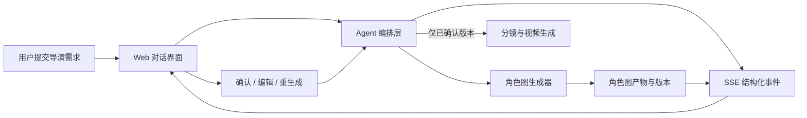

# InsightForge 对话式导演创作：状态显示、角色产物展示与 SSE PRD

**状态：已确认设计，待实现**
**范围：Web 端对话式导演创作主链路**
**版本：MVP**

## 1. Executive Summary

### Problem Statement

InsightForge 当前虽已能够向 Web 推送 token、工具执行和产物信息，但用户看到的过程仍可能表现为长文本突然出现，且底层工具状态不等于用户能理解的创作进度。用户无法在角色图生成时做出决定，导致后续分镜和视频可能建立在不满意的人物形象上。

### Proposed Solution

在既有 SSE 通道上增加面向产品的结构化创作事件；Web 将它们展示为流式文本、用户语言的阶段卡和可决策的角色图卡。角色图生成后工作流进入确认门，只有用户确认某个角色图版本后才继续规划分镜和生成视频。

### Success Criteria

- 从服务端接受用户提交到用户看到首条阶段状态的端到端 P95 小于等于 1 秒；每次创作运行均有该指标记录。
- 100% 已开始的创作运行在 UI 中显示一个明确的用户阶段或可理解的失败/停止状态。
- 100% 进入“生成角色图”阶段且生成成功的角色图，都在对话流中展示预览卡和可操作的确认门。
- 在人工验收脚本中，用户可完成“预览 → 编辑或重生成 → 确认 → 继续分镜”的闭环，且下游只使用已确认版本。
- SSE 连接断开后重连不重复渲染已消费事件；事件重放成功率达到 99.5% 以上（以有可重放事件的断线样本计）。

## 2. User Experience & Functionality

### User Personas

- **创意导演**：用自然语言提出影片想法，需要随时知道创作推进到了哪里。
- **编剧/制片人**：关心剧本和角色是否符合设想，希望在投入后续生成成本前确认角色视觉。

### User Journey

1. 用户在导演对话框提交创作需求。
2. 1 秒内，消息下方出现“正在理解你的创作需求”的运行阶段卡；若有文案生成，助理文本按增量流式呈现。
3. 阶段卡依次更新为“正在编写剧本”“正在设计角色”“正在生成角色图”等。已完成阶段保留简短结果，当前阶段显示运行中，未来阶段不预先展示。
4. 角色图生成成功后，在该阶段内出现角色图卡；工作流显示“等待你确认角色形象”，不进入分镜阶段。
5. 用户可打开大图预览、编辑角色设定后重新生成，或直接确认。重生成和编辑生成新版本，旧版本保留为历史但不可作为下游默认输入。
6. 用户确认后，卡片显示“已确认”，运行继续到“正在规划分镜”及后续视频生成。

### User Stories and Acceptance Criteria

#### US-1：看见连续的创作反馈

作为创意导演，我想在提交后立即看到创作开始并逐步读到文本，以便不把等待误认为系统无响应。

- 提交成功后，客户端在收到 `run_started` 或第一个 `stage_started` 时立即显示阶段卡；首条可见反馈必须是用户语言，不显示工具名或模型名。
- 助理文案由 `assistant_delta` 按到达顺序追加；渲染可按动画帧批处理，但不得等待 `done` 后一次展示。
- 阶段名称限定为：理解需求、编写剧本、设计角色、生成角色图、规划分镜、生成视频。服务端内部工具名不得直接作为阶段文案。
- 任一运行只能有一个“当前进行中”阶段；已完成阶段为已完成态，等待确认阶段为等待态。
- 如果服务端不能识别细分阶段，显示“正在处理你的创作任务”，不得显示空白或原始事件 JSON。

#### US-2：理解角色图产物并作出选择

作为编剧/制片人，我想在角色图生成后预览、编辑或重生成并确认它，以便后续内容使用正确的人物形象。

- `artifact_created` 为 `character_image` 时，在对应“生成角色图”阶段内显示卡片，包含角色名、缩略图、版本号和生成状态。
- 点击缩略图打开大图预览；首期不提供下载、收藏、拖拽或对其他会话复用。
- 点击“编辑”打开文本编辑面板，允许修改角色名称和角色描述；提交后创建新的角色图版本并请求重新生成。
- 点击“重新生成”在不改变角色描述的情况下创建新的角色图版本。
- 点击“确认角色图”必须携带 `run_id`、`artifact_id` 和 `artifact_version`；成功后按钮变为“已确认”。
- 当运行处于 `waiting_user`，不得开始规划分镜或生成视频；用户确认的版本是后续阶段唯一可读取的角色图版本。
- 同一角色仅允许一个已确认版本。用户确认新版本前，服务端必须拒绝或要求显式替换已有确认版本；MVP 采用“已确认后不可在当前运行内改选”，用户需要新建运行修改，避免下游回滚范围失控。

#### US-3：在异常和中断后知道下一步

作为创意导演，我想在断线、失败或停止时看到明确状态，以便重试或重新开始而不是猜测结果。

- SSE 断开时显示“连接正在恢复”，保留已展示内容且禁止将运行误标为失败。
- 重连后按事件 ID 恢复；重复事件不得新增重复阶段、重复文本或重复角色卡。
- 收到 `run_failed` 时，当前阶段展示失败原因的用户语言摘要，以及“重新开始”入口；技术错误详情仅记录埋点和服务端日志。
- 收到 `run_stopped` 时，当前阶段显示“已停止”；已生成角色图仍可预览，但不得确认以继续该已停止运行。

### UI Requirements

- 延续 InsightForge 通用工具风格：浅色优先、蓝色为主要交互与运行态工具色、系统默认字体；视觉感受应年轻、时尚且克制。
- 阶段卡置于本轮助理消息区域，不插入为普通聊天文本。运行中使用轻量动效，避免模拟“思考过程”或泄露模型推理内容。
- 角色图卡使用大缩略图优先的版式；等待确认时强调主操作“确认角色图”，次操作为“编辑”“重新生成”。
- 预留 `model_status` 与通用 `artifact_created` 渲染槽位，但首期只渲染角色图，不显示模型/工具状态，也不展示其他中间产物。

### Non-Goals

- 不展示 LLM 的思维链、token 级推理过程、工具名或模型名。
- 不覆盖图片/视频生成的独立工具页，也不改造非对话式工作流。
- 不支持角色图下载、收藏、跨项目引用、多人协同审核或角色资产库。
- 不支持用户确认后在同一运行中替换角色图并自动回滚已生成的分镜/视频。
- 不新增独立任务编排服务、队列系统或工作流编辑器。

## 3. AI System Requirements

### Tool Requirements

- Agent 编排层必须在用户可理解的阶段边界发出结构化事件，而非由前端根据工具调用猜测状态。
- 角色图生成器完成后必须返回可访问的 `artifact_id`、角色名、版本号、预览地址和所属 `run_id`。
- Agent 在角色图阶段后必须支持挂起；只有收到服务端校验通过的确认指令，才可继续下游步骤。
- 编辑和重生成命令必须带上 `run_id` 与当前版本，用于并发校验和版本链记录。

### Event Contract

现有 `GET /api/events` SSE 通道承载以下语义事件。每个事件均包含 `event_id`、`session_id`、`run_id`、`timestamp` 和 `type`；SSE 帧使用 `id: <event_id>`、`event: <type>`、`data: <JSON>`，以支持 `Last-Event-ID` 重放。

| 事件 | 关键字段 | Web 行为 |
| --- | --- | --- |
| `run_started` | `stage` | 创建本轮运行与首个阶段卡。 |
| `stage_started` | `stage`, `label` | 切换当前阶段。 |
| `stage_progress` | `stage`, `message` | 更新当前卡片的辅助文案；可选。 |
| `assistant_delta` | `delta`, `sequence` | 追加流式助理文本。 |
| `artifact_created` | `artifact_id`, `kind`, `name`, `version`, `preview_url` | `kind=character_image` 时展示角色图卡；其他类型仅缓存，首期不渲染。 |
| `approval_required` | `artifact_id`, `version`, `action=character_image` | 运行置为 `waiting_user`，展示确认门。 |
| `approval_resolved` | `artifact_id`, `version`, `decision` | 更新卡片；仅 `confirmed` 继续后续阶段。 |
| `run_completed` | `summary` | 结束运行。 |
| `run_failed` / `run_stopped` | `message`, `stage` | 结束运行并展示用户可理解状态。 |

运行状态枚举为 `queued`、`running`、`waiting_user`、`completed`、`failed`、`stopped`。同一 `run_id` 的事件必须单调递增，客户端以 `event_id` 去重，以 `sequence` 保证文本拼接顺序。

### Evaluation Strategy

- **事件契约测试**：覆盖所有事件类型、缺字段拒绝、`event_id` 去重、乱序 `assistant_delta`、`approval_required` 前置校验。
- **Agent 流程测试**：使用固定角色图生成桩，验证未确认时不调用分镜/视频工具；确认版本准确传入下游；编辑和重生成创建新版本。
- **Web 交互测试**：验证首阶段卡、流式文本追加、角色图预览、编辑、重生成、确认、失败、停止和断线重连状态。
- **体验验收**：10 条标准导演提示词进行端到端测试，记录提交至首可见状态的 P50/P95；P95 必须小于等于 1 秒。

## 4. Technical Specifications

### Architecture Overview

1. Web 提交消息后，后端创建 `run_id` 并立即发布 `run_started`，然后由 Agent 分阶段运行。
2. 后端 SSE 桥接层将 Agent 的内部 JSONL/工具信号归一为上述事件；既有 token 事件映射为 `assistant_delta`。
3. Web 的运行状态仓库按 `run_id` 保存阶段、文本缓冲、产物版本和确认状态；渲染层只消费这个仓库，不解析工具输出。
4. `approval_required` 到达时，Agent 持久化运行位置并释放后续执行；用户操作通过 HTTP 命令 API 回传，后端做版本与运行状态校验后发布 `approval_resolved`。
5. SSE 重连时客户端提交 `Last-Event-ID`；服务端从本次 `run_id` 的可重放事件存储补发缺失事件，再回到实时订阅。

### Integration Points

- **既有 SSE 端点**：`GET /api/events` 扩展事件名、ID 和重放能力；心跳保持 15 秒一次，避免代理闲置断连。
- **既有 Agent JSONL 桥接**：增加阶段映射和角色图/确认事件，不把前端展示逻辑放入 Agent 文案。
- **角色图产物接口**：复用既有会话产物存储与预览 URL；补充 `run_id`、`role_id`、`version`、`approval_status` 元数据。
- **新命令 API**：`POST /api/runs/:runId/character-approval` 接收 `confirm`；`POST /api/runs/:runId/character-regeneration` 接收 `regenerate` 或 `edit` 及修改后的角色设定。两类请求均返回 202，最终状态以 SSE 为准。
- **埋点**：客户端和服务端共享 `run_id`、`session_id`、`event_id` 与匿名用户/项目标识；不得以消息正文或图片二进制作为埋点属性。

### Analytics Specification

| 事件 | 触发时机 | 必填属性 |
| --- | --- | --- |
| `director_run_submitted` | 用户提交后 | `run_id`, `session_id` |
| `director_first_status_visible` | 首阶段卡实际渲染时 | `run_id`, `latency_ms`, `stage` |
| `director_stage_changed` | 阶段状态变化 | `run_id`, `stage`, `status`, `elapsed_ms` |
| `character_artifact_visible` | 角色图卡进入视口 | `run_id`, `artifact_id`, `version` |
| `character_artifact_previewed` | 打开大图 | `run_id`, `artifact_id`, `version` |
| `character_approval_actioned` | 编辑、重生成或确认 | `run_id`, `artifact_id`, `version`, `action` |
| `director_sse_reconnected` | 重连成功 | `run_id`, `downtime_ms`, `replayed_event_count` |
| `director_run_finished` | 完成、失败或停止 | `run_id`, `outcome`, `final_stage`, `duration_ms` |

### Security & Privacy

- SSE 订阅、产物预览和确认命令必须沿用会话鉴权；服务端不得仅因客户端提供的 `artifact_id` 授权访问或确认产物。
- 服务端必须校验 `artifact_id`、`run_id`、会话归属、版本号和当前状态，拒绝跨会话、过期或已停止运行的确认请求。
- 角色图预览 URL 使用既有受控产物端点或短时签名 URL，不在 SSE payload 中传递图片二进制。
- 事件重放保留最小必要数据；日志和埋点只记录 ID、时间、阶段和结果，不记录原始提示词、角色描述或图片内容。

## 5. Risks & Roadmap

### Phased Rollout

| 阶段 | 交付内容 | 上线门槛 |
| --- | --- | --- |
| MVP | `run_started`、阶段卡、`assistant_delta` 流式文本、角色图卡、确认/编辑/重生成、确认门、核心埋点 | 契约/流程/UI 自动化通过；10 条提示词的首状态 P95 ≤ 1 秒。 |
| v1.1 | `Last-Event-ID` 重放、断线恢复、事件可观测面板、阶段耗时告警 | 断线重放成功率 ≥ 99.5%。 |
| v2.0 | 可选的模型状态展示、分镜/场景等其他中间产物、确认后安全的下游回滚设计 | 基于 MVP 埋点确认用户价值后立项。 |

### Technical Risks and Mitigations

- **代理缓冲或 Agent 首事件过晚**：在接受请求后由服务端直接发 `run_started`，设置 `no-transform`、禁用代理缓冲并发送心跳；监控首状态延迟。
- **事件重复、乱序或前端重连造成 UI 污染**：强制事件 ID、文本序列号和运行状态机；客户端幂等消费。
- **用户多次点击确认/重生成导致版本冲突**：确认/重生成 API 使用 `run_id + artifact_id + version` 比较；服务端只允许一个待确认版本操作进入执行。
- **确认门无限等待占用资源**：MVP 仅挂起下游执行，不占用生成 worker；产品不承诺自动超时继续，用户可手动停止或新建运行。
- **阶段映射与真实进度不一致**：阶段由编排层显式发出；工具级进度只作为阶段辅助文案，不可覆盖阶段状态。

### Release Decision

满足 MVP 上线门槛后灰度至对话式导演创作用户。灰度期每周审阅首状态延迟、角色图曝光到确认转化、重生成率、等待确认后完成率和 SSE 重连失败率，再决定是否进入 v1.1。
